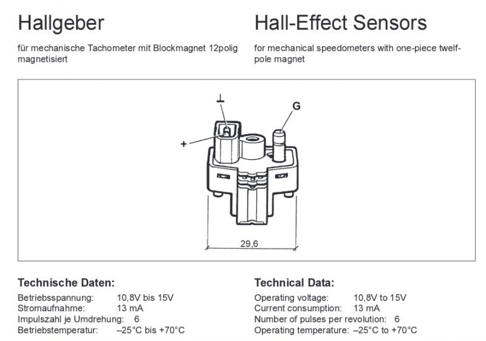
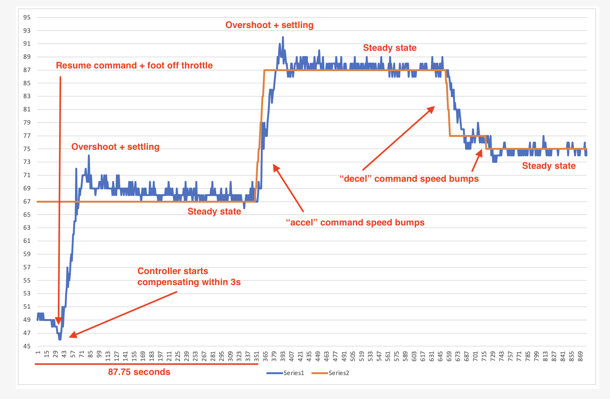
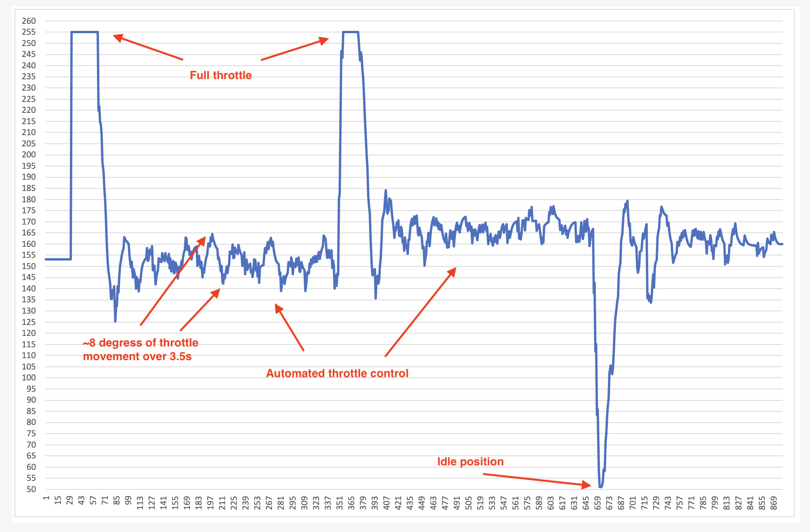

# WARNING

This code is **incomplete and entirely experimental**. It's sole purpose is to demonstrate the capabilities of the ATMega4809 microcontroller, while solving a practical problem. If you decided to use any part of this code in any way and for any purpose, you are doing so **entirely at your own risk**, and acknowledge no responsibility on my part for any damage or harm to anyone or anything.

That's the "covering my ass" bit done.

# Project description

This project implements a cruise control (tempomat) controller that is supposed to be a drop-in replacement for the 14-pin VDO control boxes, with coding plug, found in many cars of the 1990s. These systems interfaced with an independent electro-mechanical servo, rather than electronic throttle actuators or vacuum actuators. An example is the VDO Tempostat 83.601, and almost all Mercedes-Benz cruise control systems of the 1990s (see details in "System configuration" below).

An earlier version of this project was tested in a W124 280TE, with passable results. As of April 2021, this version has also been tested with a W124 280TE and has achieved performance comparable with, and in some cases better than the original VDO units.

The servo control loop uses a PID controller with no input filtering.
The speed control loop uses a PI controller with input filtering.

The gains used by the speed control loop in this code are specific to my test vehicle. They may be entirely inadequate for others, including from the same model range. The servo control loop has been bench-tuned, and works very well with the original VDO actuators, provided they are in good operational condition.

# System configuration

To the best of my knowledge, cruise control on the W124 was implemented in two ways:

- early petrol (M102, M103), and diesel models: independent control box with a electro-mechanical servo actuator linked to the throttle mechanism
- late petrol (M104, M111) models with drive-by-wire (electronic) throttle: cruise control built into ECU, and controlling the throttle plate directly via a servo built into the ETA (electronic throttle actuator)

We're dealing with the first type here exclusively. I'm not aware of any project "out there" attempting to reverse engineer the later configuration.

## Core elements

The system consists of three core elements:

- speed sensor
- cruise control box / amplifier
- servo actuator

### Speed sensor

The current speed of the vehicle is fed to the control box by means of a hall sensor (A0075422917) mounted into the instrument cluster, just beside the speedometer. The speedometer has twelve-pole magnet built in, which triggers the hall sensor. The sensor is of a latching type, i.e. when turned on, it latches in the on state until a magnetic field of opposite direction is applied. In this configuration, there are six square wave pulses per each full revolution of the speedometer cable. The peak voltage of those pulses is battery voltage (VBatt). There are 8579 pulses per kilometer ("K" number from VDO 519.201/7/03 reference resistor). This is the case both for speedometers scaled in mph and km/h. At 50km/h (31mph) there will be 119 pulses/s; the ratio is 1:2.38.

This also forces how speed calculation is done by the control box. With a non-latching sensor measuring the frequency and period between signal edges gives the best accuracy (the test bench version of this code uses this approach). With a latching sensor however, we have to fall back to counting the number of pulses in a fixed time window, which - at least when using the internal 32.768kHz ULP oscillator of the ATMega4809 as gate timer [1] - isn't very accurate, and requires filtering to smooth out the noise to where it does not affect controller performance.

### Control box

The control box is the heart of the system. The 14-pin version this project is concerned with has a secondary part referred to as "coding plug" or "reference resistor". The exact purpose of this element is not fully known, however - given these control boxes were used on a varied range of vehicles, not only from Mercedes-Benz - it most likely configures core parameters of the system: expected number of pulses per distance unit, tuning of the control loop etc. This is supported by vague remarks in WIS 30-5xx, and the original PCB layout. Another universal product from VDO the "[compact tempostat](http://oldhymer.com/wp-content/uploads/VDOCruiseControl.pdf)" uses DIP switches for the same purpose. The reference resistor contains [four to six resistors](./images/coding_plug.png) in a [specific range of values](./images/coding_plug_values.jpeg) for each version of the part. The six terminals can be traced to inputs of the LM2901 quad-comparator and a couple pins on the TMAT-724 chip.

The control box accepts several inputs:

- accel/decel/cancel/resume signal from the control stalk
- "brakes applied" signal
- speed signal (described above)

The accel/decel/cancel/resume commands are on/off signals. The low (off) state is 0V, the high (on) state is VBatt. The accel/decel commands serve two functions:

- when held in the on state, the car will accelerate/coast until the command signal returns to the off state, at which point the current speed becomes the target speed for the system
- when triggered (short on/off cycle), the current speed will be increased or decreased by 1km/h

- The resume command sets the last known target speed as the current target, and enables the system.
- The cancel command stores the current target speed, and disables the system by parking the servo actuator. The servo clutch remains engaged.
- The stored target speed is lost when the control box is powered off.

The "brakes applied" input must sense ground for the system to remain engaged. When the brake pedal is pressed, this input is brought high to Vbatt. This immediately (and independently of the control box) disengages the servo actuator clutch, disconnecting the system. The control box monitors this input to reset its internal state accordingly. Current target speed is preserved, and can be recalled via the resume command. The system does not appear to implement an automatic resume-after-breaking function, which would see the control loop re-engaged as soon as the current speed is at, or above the last target speed again.

### Servo actuator

The servo actuator is as an electro-mechanical DC servo, with position feedback through a potentiometer. It also has a built-in safety mechanism, by means of a solenoid control clutch which, when enabled, meshes the motor gear with the actuator gears. The current servo position can be overriden by the driver pressing the throttle pedal. The clutch is engaged by the control box, but disengaged only by the brake pedal being applied, or ignition being turned off.

Position feedback is done via a 5kOhm potentiometer, which is unfortunately very noisy. You will notice that I have dropped the resolution of the ADC in my code to 8-bit (0-255), instead of 10-bit (0-1023) and enabled oversampling and random sampling delay. This was done based on test results from the first version of this code, where positioning the servo reliably was almost impossible due to noise. There is however enough room in the housing to embed a more accurate encoder (future project, maybe...).

# Harwdware
Latest version of the schematic of the control box can be found [here](https://github.com/ptashek/mb/tree/master/CruiseControl_W124/schematic/). Detailed BOM will be made available once I'm happy with the selected parts. The hardware portion is work in progress, and errors/omissions should be expected.

**Note:** PCB fabrication files will not be published.

# Software
Each software revision is tightly coupled to a specific version of the hardware. They will be published in tandem.

# System performance

**Current as of April 2021**

The first “resume” part is on an uphill gradient, cresting the hill at about 2/3 of that segment. The second part is on a motorway. The blue line is current speed (unfiltered), and orange is the reference speed (setpoint).

# References

[1] See section 33.9 in [ATMega4809 datasheet](https://ww1.microchip.com/downloads/en/DeviceDoc/ATmega4808-09-DataSheet-DS40002173C.pdf)

# LICENSE

Creative Commons Attribution-NonCommercial-ShareAlike 4.0 International (CC BY-NC-SA 4.0)

https://creativecommons.org/licenses/by-nc-sa/4.0/
